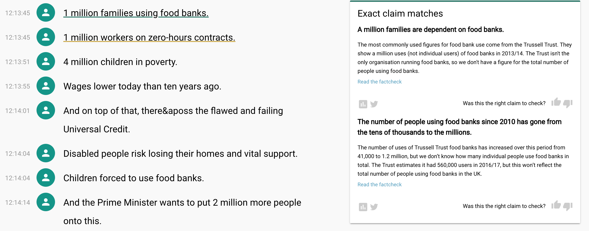
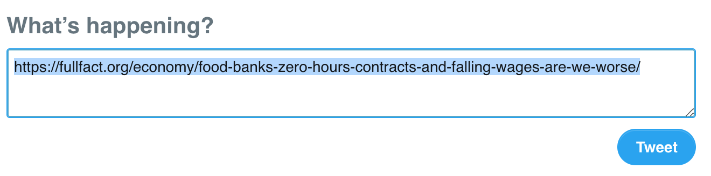
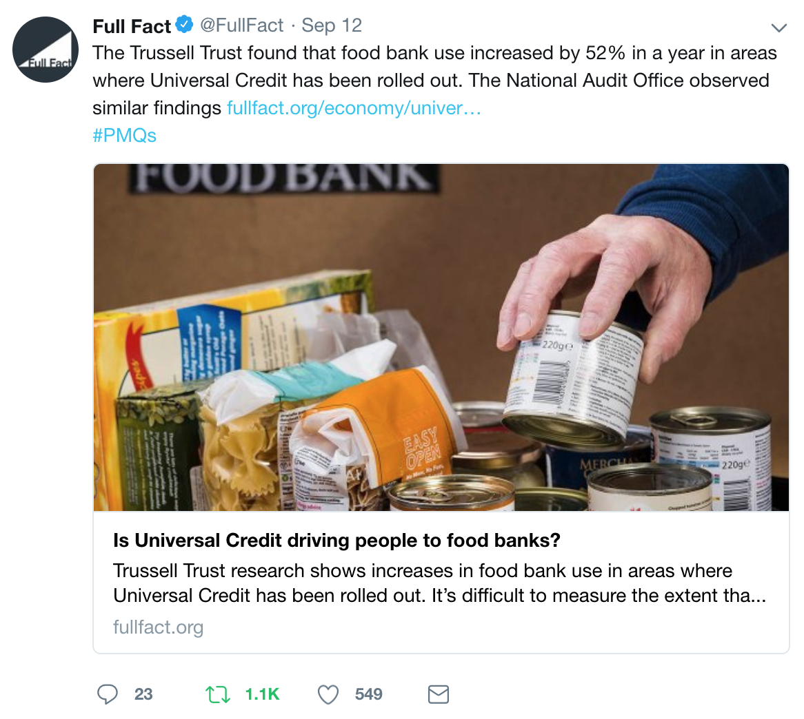
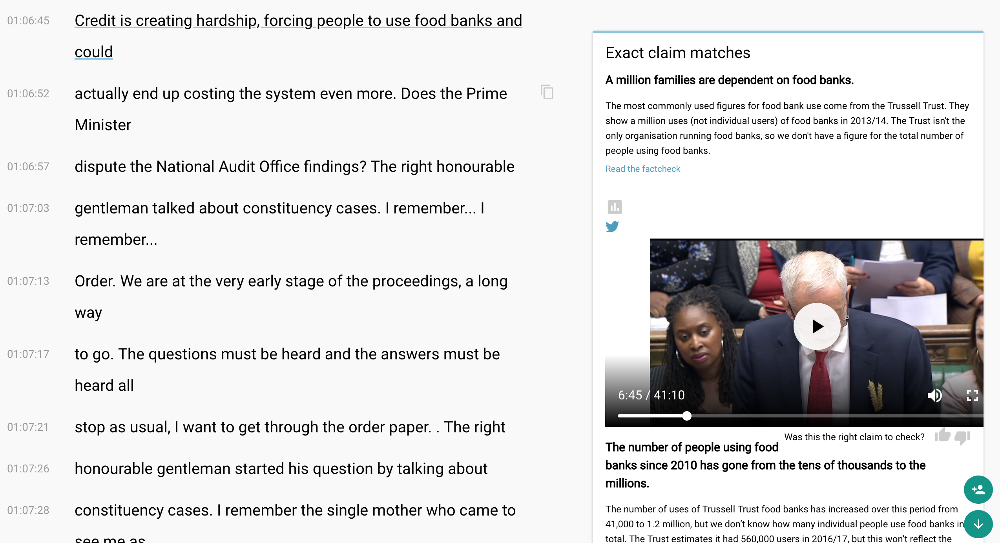

# Full Fact - tweet that clip

**TL;DR:** Tweets out a small clip of a show \(e.g. Prime Ministers Questions\) during live factchecking. The media/clip is of the person who makes a claim that is then being checked in the text of the tweet.

...you can now see the clip of the moment they said the claim, ready to be tweeted out. After you press the tweet button it automatically tweets out the clip.

{{ video place holder }}


## **Why is this helpful?** 

Full Fact live factchecks Prime Ministers Questions and BBC Question Time on Twitter. Members of the team tweet out factchecks of the statements politicians and guests make.

If we can add small clips of the politicians or guests actually _making_ the statements we believe the experience for the public would be much nicer!

## **Before**

The sentences are matched to Full Fact's previous factchecks



and when you click the Twitter button it takes you to a draft tweet with just the link of the factcheck in:



In the real world the final output looks like this



## **After**

Everything is a little broken, and the sentences are a bit weird, _but_ you can now see a preview of a video inline. 



And when you click tweet...

{% embed data="{\"url\":\"https://twitter.com/pietropassarell/status/1042435448398864384\",\"type\":\"rich\",\"title\":\"Pietro on Twitter\",\"description\":\"The Trussell Trust found that food bank use increased by 52% in a year in areas where Universal Credit has been rolled out. The National Audit Office observed similar findings https://t.co/b9KtuYnUWx pic.twitter.com/PitSWJwgZI— Pietro \(@pietropassarell\) September 19, 2018\\n\\n\",\"icon\":{\"type\":\"icon\",\"url\":\"https://abs.twimg.com/icons/apple-touch-icon-192x192.png\",\"width\":192,\"height\":192,\"aspectRatio\":1},\"thumbnail\":{\"type\":\"thumbnail\",\"url\":\"https://pbs.twimg.com/ext\_tw\_video\_thumb/1042435426760503303/pu/img/6I1ABCAzFOpeh5\_y.jpg\",\"width\":1200,\"height\":668,\"aspectRatio\":0.5566666666666666},\"embed\":{\"type\":\"app\",\"html\":\"<blockquote class=\\\"twitter-tweet\\\" data-dnt=\\\"true\\\" align=\\\"center\\\"><p lang=\\\"en\\\" dir=\\\"ltr\\\">The Trussell Trust found that food bank use increased by 52% in a year in areas where Universal Credit has been rolled out. The National Audit Office observed similar findings <a href=\\\"https://t.co/b9KtuYnUWx\\\">https://t.co/b9KtuYnUWx</a> <a href=\\\"https://t.co/PitSWJwgZI\\\">pic.twitter.com/PitSWJwgZI</a></p>&mdash; Pietro \(@pietropassarell\) <a href=\\\"https://twitter.com/pietropassarell/status/1042435448398864384?ref\_src=twsrc%5Etfw\\\">September 19, 2018</a></blockquote>\\n<script async src=\\\"https://platform.twitter.com/widgets.js\\\" charset=\\\"utf-8\\\"></script>\\n\",\"maxWidth\":550,\"aspectRatio\":1}}" %}

**Slides:** [https://docs.google.com/presentation/d/1uEjC8hpJGVkvXLH4i9\_tmwPHON77UrrS4nzTKLth46U/edit\#slide=id.g42107b0f4e\_0\_59](https://docs.google.com/presentation/d/1uEjC8hpJGVkvXLH4i9_tmwPHON77UrrS4nzTKLth46U/edit#slide=id.g42107b0f4e_0_59) 


## Github

Node module to tweet to clip + text status



Example server micro-service 

{% embed data="{\"url\":\"https://github.com/pietrop/tweet-that-clip-server\",\"type\":\"link\",\"title\":\"pietrop/tweet-that-clip-server\",\"description\":\"an example server to create an end point for the \`tweet-that-clip\` module  \(https://github.com/pietrop/tweet-that-clip\) - pietrop/tweet-that-clip-server\",\"icon\":{\"type\":\"icon\",\"url\":\"https://github.com/fluidicon.png\",\"aspectRatio\":0},\"thumbnail\":{\"type\":\"thumbnail\",\"url\":\"https://avatars3.githubusercontent.com/u/4661975?s=400&v=4\",\"width\":372,\"height\":372,\"aspectRatio\":1}}" %}

## Next up 

Look into tweeting as draft  


Post end point

```text
POST 
http://ads-api.twitter.com/4/accounts/18ce54d4x5t/tweet?text=hello,+world&as_user_id=756201191646691328&trim_user=true  

```

Draft end point

```text
POST 
https://ads-api.twitter.com/4/accounts/18ce54d4x5t/draft_tweets?as_user_id=756201191646691328&text=Just+setting+up+my+Twitter
```

### Other improvements

* Creating a draft tweet with the ability to add text
* Custom controls for the HTML5 video player, to hone in on the right timestamps
* Sort out the video pipeline
* Add subtitles/closed captions directly onto the video
* Configure it to the Full Fact account

\*\*\*\*

## **Team**

* Mevan Babakar, Full Fact 
* Simon Coltman, Full Fact 
* James Dooley, BBC News Labs
* Dave Bevan, BBC News Labs
* Pietro Passarelli, BBC News Labs

