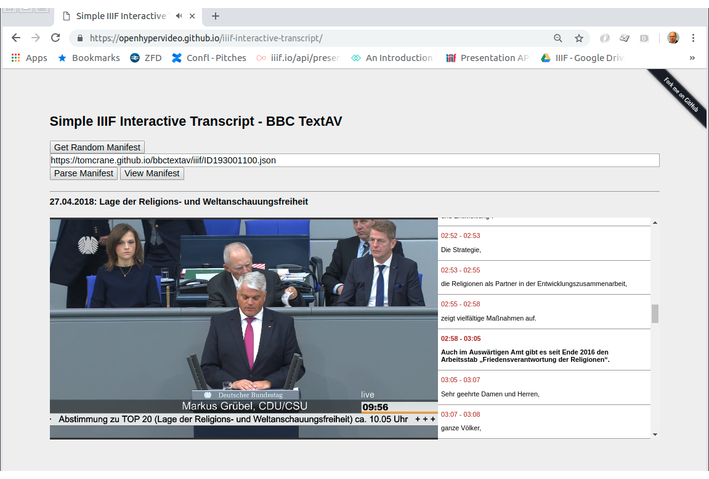

# IIIF Interactive Transcript - Parliamentary Debates

One of the demos on Day 1 of BBCTextAV was the BBC's FastForward, which synchronises scrubbing of video with the text transcript \(navigating through either video or text changes your position in the other\).

{{ video place holder }}

This would be useful functionality to have available for [IIIF](https://iiif.io/api/presentation/3.0/) AV content, where the text transcript comprises textual annotations on the time dimension of the canvas. So we decided to build a proof of concept viewer. 

We had access to metadata for ~3500 German parliamentary debates. We transformed this metadata to IIIF Manifests, ending up with one [Manifest](https://iiif.io/api/presentation/3.0/#52-manifest) per debate, each with one [Canvas](https://iiif.io/api/presentation/3.0/#53-canvas) representing the duration of the debate, annotated with a video file to provide the AV content. Other sources of textual data were available, but for this MVP we used the WEBVTT files as source for the transcripts. 

Sample Manifest:

[https://tomcrane.github.io/bbctextav/iiif/ID191002001.json](https://tomcrane.github.io/bbctextav/iiif/ID191002001.json)

This links to an annotation list for the text content:

[https://tomcrane.github.io/bbctextav/iiif/ID191002001-transcript.json](https://tomcrane.github.io/bbctextav/iiif/ID191002001-transcript.json)

The parliamentary source data is hacked into IIIF here: [https://github.com/tomcrane/bbctextav/blob/master/converter/make\_iiif.py](https://github.com/tomcrane/bbctextav/blob/master/converter/make_iiif.py)

We produce a IIIF Collection of the manifests, so the viewer software knows what's available:  
[https://tomcrane.github.io/bbctextav/iiif/collection.json](https://tomcrane.github.io/bbctextav/iiif/collection.json)

The manifests are then shown using this viewer:

[https://openhypervideo.github.io/iiif-interactive-transcript/](https://openhypervideo.github.io/iiif-interactive-transcript/) 

## **Team**

* Joscha Jaeger
* Tom Crane

